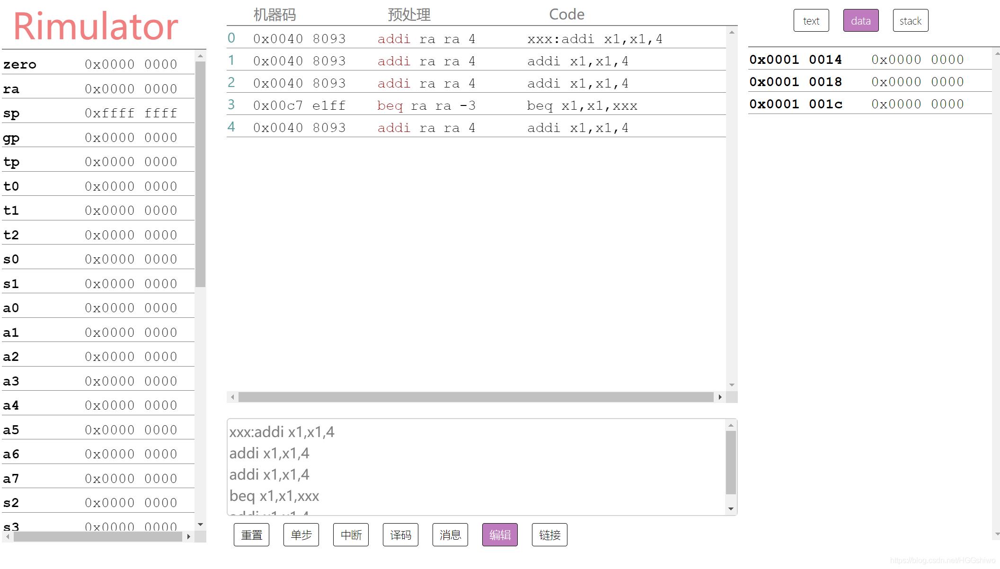

# Rimulator

## Rimulator是什么?

Rimulator是一款基于web的轻量级riscv IDE，也是目前市面上唯一一款使用人数为0并且广受好评的RiscV模拟器 
## Rimulator的特点

Rimulator部署在网页端，以下是它的网址:[https://hggshiwo.github.io/rimulator/index.html](https://hggshiwo.github.io/rimulator/index.html)

Rimulator 广泛借鉴了venus，在此基础上取消了一些指令的支持，十分具有人性化。

在此基础之上，Rimulator支持实时编译，在线跟踪，寄存器值查看，堆栈自动分配等功能

## Rimulator的使用

左侧是寄存器，不必多说。作者认为寄存器必须被严格保护，所以不支持直接修改。

中间是代码区，点击code栏，输入代码，通过enter增行，delete删行, 上下键切换行

下面是输出框，点重置清空寄存器，单步进行单步调试，

特色: 点中断模拟一个中断(其实没有实现，因为作者烂尾了)

点译码，将机器码输出，点消息，查看报错，点编辑，查看原码，点链接，输入链接命令。

(链接并没有实现，原因如上)

左侧是堆栈区。

## RV32I支持情况

Rimulator对RiscV的支持处于初级阶段(原因如上)

|   项     | 支持情况 | 备注 |
| -------- | ------ | -------- |
| R型指令  | 支持   |          |
| I型指令  | 支持   |          |
| B型指令  | 支持   |          |
| S型指令  | 支持   |          |
| J型指令  | 支持   |          |
| U型指令  | 支持   |          |
| 特权指令 | 不支持 | 烂尾     |
| 中断处理 | 不支持 | 烂尾     |
| 伪指令   | 不支持 | 烂尾     |

# 总结

venus已经很好用了，但是有若干缺陷:
- 不支持特权指令
- 不支持中断 
- 编辑区无法运行，运行区无法编辑

Rimulator的编辑区做的挺好，但是取消了很多指令支持，就是因为作者烂尾了。

从寄存器来看，本来支持m型寄存器，但是最后也没做，但是从现有的架构上增加也不是很困难，就是看作者心情了。我们期待作者能够完成烂尾的部分。

# 最后
扯了挺多，其实用几个字总结一下: 有x用。